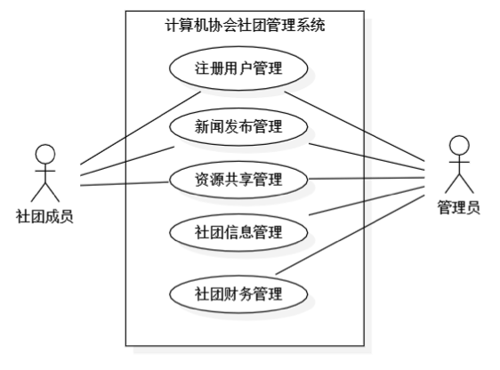
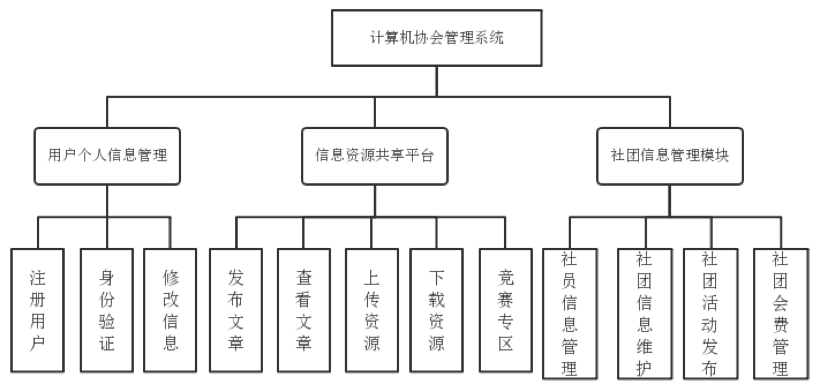
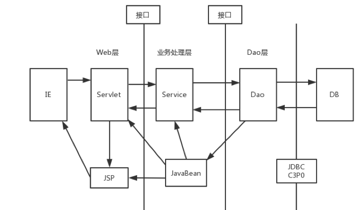

# 1 Overview
- Guided by the process framework of RUP, the computer association management system uses UML modeling tools to analyze the functional model of the university community management system in detail, drawing use case diagrams, class diagrams, activity diagrams, sequence diagrams, communication diagrams, and status diagrams to make the development process structure of the system clear, functional and easy to maintain. 
-  Java EE framework is adopted.
-  Based on B/S three-layer structure mode, the author uses MYSQL as the database to develop the system. 
- Apache Tomcat is used as the server. 
- The web page uses Bootstrap framework.  
- DBUtils and C3P0 connection pooling techniques are used for database operations. 
- In order to realize the user to edit the article in the browser, the author developed a WEB rich text editor.
-  The main function modules of the system are user information management module, news information sharing module, community financial management module and community information management module. 
-  You can access the website [here](http://www.qyh-xx.top/ComputerAssociation).

# 2 Diagrams

There are some diagrams helping you understand the system.

### 2.1 Use case diagram

### 2.2 System structure

### 2.3 Layered system

# 3 Presentation

